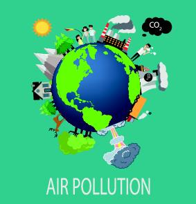

# **U.S. Electric Power Plants and Their Contribution on Air Pollution**

## **About the project**

Air pollution created by human activities (e.g. transportation and industrial production) or by natural events (e.g. wildfires) has been linked to severe environmental and public health consequences. Climate change, for example, has been at the center of national attention and left unchecked could have profound and irreversible effects on our planet.
 
This report provides a comprehensive analysis of U.S. power plant emissions from 2016 through 2019. We focus on three main pollutant gases emitted through the electricity production process: carbon dioxide (CO2), sulfur dioxide (SO2), and nitrogen oxides (NOx). We consider the relative production of these gases by U.S. power plants and associated environmental concerns.

